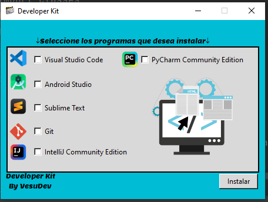

# Developer Kit


## Descripción

**Developer Kit** es una aplicación de escritorio desarrollada en Python que facilita la instalación de los programas más utilizados por desarrolladores. Esta herramienta es especialmente útil para aquellos que frecuentemente cambian de ordenador y necesitan instalar de nuevo sus herramientas de desarrollo.

## Objetivo

El propósito de esta aplicación es automatizar la instalación de programas esenciales para desarrolladores, evitando la tediosa tarea de instalarlos manualmente cada vez que se cambia de ordenador.

## Tecnologías Utilizadas

- **Lenguaje de Programación:** Python 3
- **Interfaz Gráfica de Usuario:** Tkinter
- **Ejecución de Instaladores:** Subprocess

## Funcionalidades

- **Interfaz Gráfica de Usuario (GUI):** La aplicación cuenta con una interfaz gráfica intuitiva y fácil de usar.
- **Selección de Programas Instalables:** Los usuarios pueden seleccionar los programas que desean instalar desde una lista que incluye:
  - Visual Studio Code
  - Android Studio
  - Sublime Text
  - Git
  - PyCharm Community Edition
  - IntelliJ Community Edition
- **Botón de Instalación:** Un botón de "Instalar" que inicia el proceso de instalación de los programas seleccionados.
- **Mensajes de Alerta:** Informan al usuario sobre el progreso y posibles errores durante la instalación.
  
## Estructura del Código

### Clase `Gui`
Encargada de crear y gestionar la interfaz gráfica de usuario. Esta clase maneja la lógica de interacción con el usuario y la selección de programas.

### Clase `Instalador`
Responsable de la instalación de cada programa individual. Utiliza el módulo `subprocess` para ejecutar los comandos de instalación.

## Instalación

### Pasos de Instalación

1. **Descargar el Proyecto:** Clona este repositorio en tu máquina local.

    ```bash
    git clone [URL_DEL_REPOSITORIO]
    ```

2. **Instalar Dependencias:** Si necesitas instalar alguna dependencia adicional, utiliza el siguiente comando (aunque `Tkinter` y `Subprocess` vienen instalados por defecto con Python):

    ```bash
    pip install -r requirements.txt
    ```

3. **Ejecutar la Aplicación:** 

    ```bash
    python main.py
    ```

    Esto abrirá la interfaz gráfica del Developer Kit.

## Uso de la Aplicación

1. Al iniciar la aplicación, selecciona los programas que deseas instalar marcando las casillas correspondientes.
2. Presiona el botón "Instalar" para comenzar la instalación.

## Evolución del Proyecto

### Futuras Mejoras

- Implementar un script que descargue las últimas versiones de los instaladores de cada programa desde sus sitios web oficiales.
- Desarrollar una funcionalidad que permita una instalación totalmente automatizada sin interacción del usuario.
- Añadir un scrollbar para aumentar el número de programas disponibles, incluyendo categorías como IDEs, sistemas de control de versiones y bases de datos.

## Conclusión

Este proyecto fue desarrollado en un periodo de 15 días, comenzando con tareas de investigación y aprendizaje. Estoy orgulloso del resultado obtenido, y aunque enfrenté varios desafíos, todos fueron superados.

